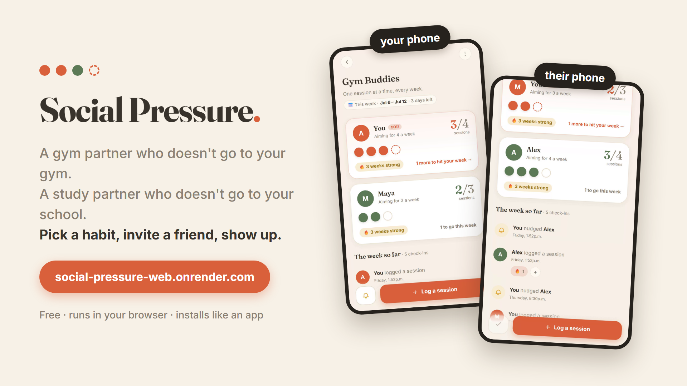
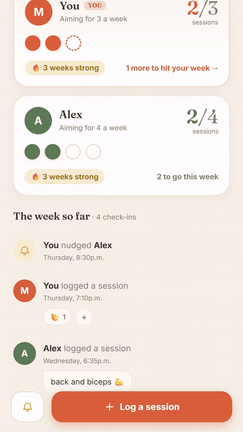

# Social Pressure

Accountability-partner app: define a project, invite partners by link, log activity
events in one tap, and let mutual visibility + web push notifications keep everyone on
track. The human element is the feature; everything else is plumbing.



**Live app:** https://social-pressure-web.onrender.com
**Source:** https://github.com/Fingolfin7/Social-Pressure

## The loop in action

You log a session; your partner's screen updates seconds later, and they can
react or nudge you right back:



There's also a one-minute walkthrough video, produced by the scripts in
[promo/build/](promo/build/) — seeded demo data, Playwright phone-emulated screen
recordings, ffmpeg assembly — so it can be regenerated after UI changes. The
rendered videos are kept out of git; run the build scripts to reproduce them.

See [plan.md](plan.md) for the product plan and [design/UI_DESIGN.md](design/UI_DESIGN.md)
for the "Roster" visual system.

## Status

**V1 loop is complete** — create → invite → log → partner sees → pressure works
end to end:

- Email/username auth with a bare profile (name, avatar).
- Create a project with one activity (name, unit, daily/weekly/monthly cadence) and a
  fixed end date or indefinite run; opinionated templates + custom.
- Invite partners by shareable link; per-member targets set on join.
- One-tap event logging with an optional note, and undo.
- Project screen: each member's count vs. their target this period, streaks, and a
  live feed of check-ins.
- Emoji reactions on logged events and a rate-limited nudge button.
- Real-time web push when a partner logs; self-healing subscriptions with a disable
  toggle.
- Installable PWA (manifest, service worker, offline page, app icons).

Not yet built (see the roadmap in [plan.md](plan.md)): the outcomes/trend layer,
weekly digest notifications, and dead-partner mechanics (pause/archive).

## Stack

Django 5, server-rendered templates, one hand-written CSS file, and a small amount of
vanilla JS (no React, no build step). Web push via `pywebpush` + VAPID. SQLite locally,
Postgres in production, static/media on S3.

## Run locally

```powershell
.\.venv\Scripts\Activate.ps1
python manage.py migrate
python manage.py runserver
```

Sign up at `/users/register/`. Admin at `/admin/` (create a superuser with
`python manage.py createsuperuser`).

## Web push setup

VAPID keys live in `.env` (`VAPID_PRIVATE_KEY`, `VAPID_PUBLIC_KEY`, `VAPID_ADMIN_EMAIL`).
Regenerate with:

```powershell
python manage.py generate_vapid_keys
```

### Testing push on a phone

Service workers and push require a secure context (HTTPS or localhost), so plain
`http://<lan-ip>:8000` will NOT work. Two options:

1. **HTTPS tunnel** (e.g. `cloudflared tunnel --url http://localhost:8000`), then add
   the tunnel URL to `.env` as `CSRF_TRUSTED_ORIGINS=https://xyz.trycloudflare.com`
   and restart the server.
2. **Android USB**: enable USB debugging, connect, run `adb reverse tcp:8000 tcp:8000`,
   then open `http://localhost:8000` on the phone (localhost is a secure context).

Then on the phone: open the URL → sign up/log in → "Enable notifications" →
"Send test notification". Install via browser menu → "Add to Home screen".
iOS note: web push only works from the *installed* PWA (16.4+), so add to home
screen first there.

## Deployment

Deployed on [Render](https://render.com) via [render.yaml](render.yaml) (free tier,
Frankfurt). The build runs [build.sh](build.sh) (installs deps, collects static, runs
migrations) and serves with gunicorn against a Render Postgres database, with static and
uploaded media on S3.

Required environment variables (see `render.yaml`): `SECRET_KEY`, `DATABASE_URL`,
`USE_S3` + the `AWS_*` keys for the S3 bucket, and the `VAPID_*` keys for web push.
`DJANGO_DEBUG=0` and `SECURE_SSL_REDIRECT=1` in production. `RENDER_EXTERNAL_HOSTNAME`
is set automatically by Render and is added to `ALLOWED_HOSTS` / `CSRF_TRUSTED_ORIGINS`.
